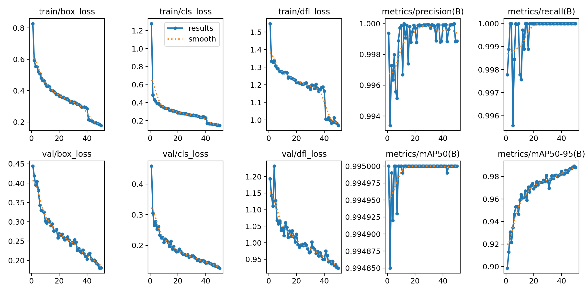
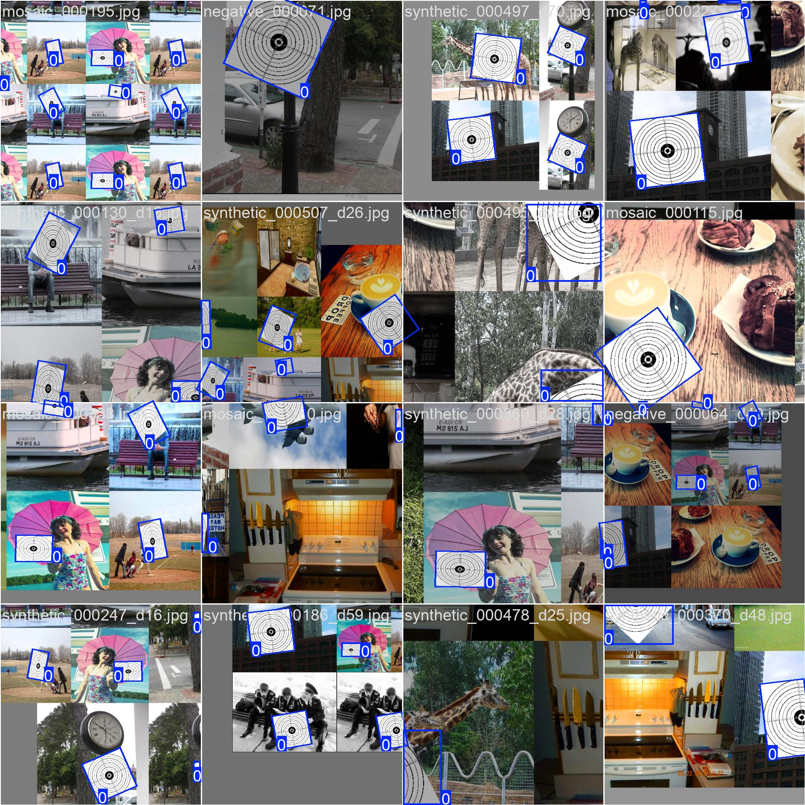
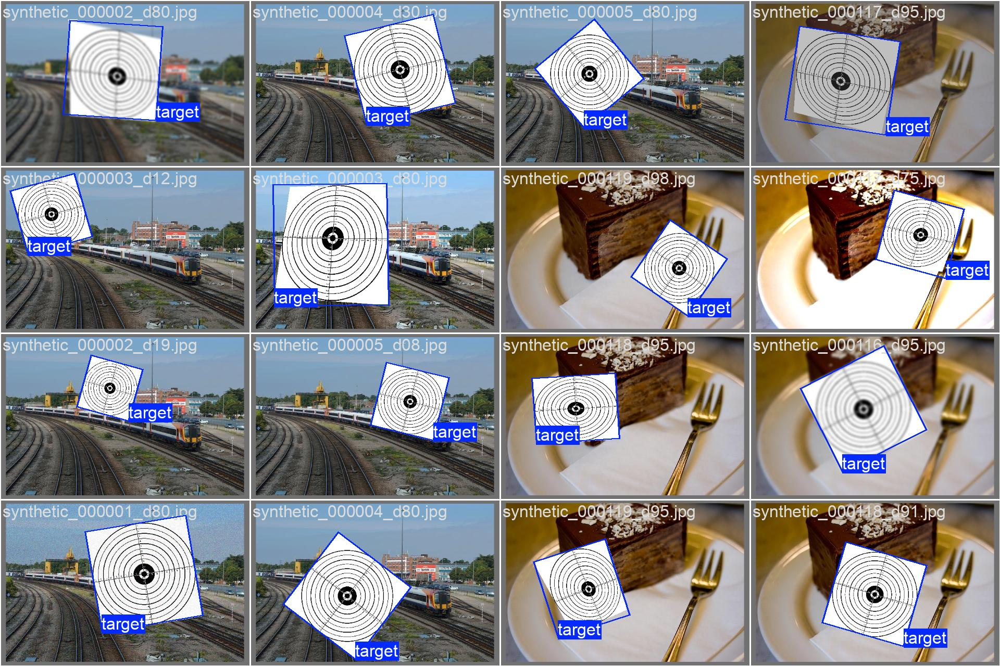
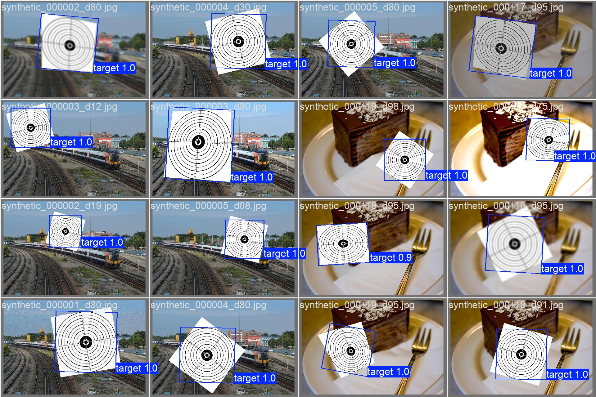

# yolo-fine-tune

weekend project for fine-tuning YOLO11 on oriented bounding boxes (OBB)

basically generates synthetic training data by pasting target images onto coco128 backgrounds w/ random augmentations, then trains a detector that handles rotated bounding boxes

## results

training converged pretty well! here's what i got:

### training metrics


losses went down nicely, mAP looks good. probably could've trained longer but 50 epochs seemed enough

### training samples


example of the training data - you can see the difficulty-based augmentation working (rotation, scaling, perspective warp, etc)

### validation results

*ground truth labels*


*model predictions*

predictions look pretty solid! the model learned to detect rotated objects which was the whole point lol

## what i learned

- OBB coordinate math is surprisingly tricky
- synthetic data generation is powerful but has limits (domain gap is real)
- proper train/val splitting matters a lot when using augmentation
- the difficulty-based augmentation system worked better than i expected
- should've collected more real data to validate on

## setup

```bash
# install deps
uv sync

# generate dataset
make ingest

# train model
make train

# check results
python dataset_debugger.py
```

## stuff that could be better

- dataset is small (~1,800 images)
- only single class detection
- no real-world validation data
- geometry difficulty cap (0.6) was kinda arbitrary
- could use more augmentation types

but hey it works and i learned a ton 🤷
